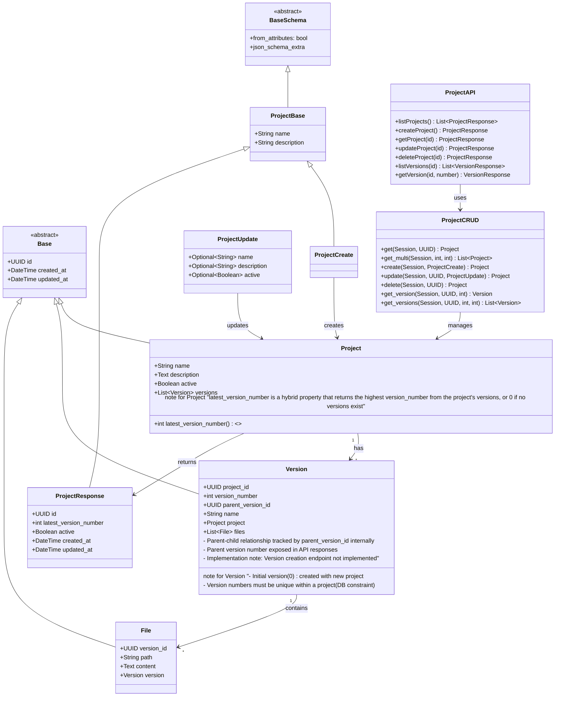

# Projects API

A FastAPI microservice for managing projects and their versions.

## Setup

1. Create a virtual environment and activate it:
```bash
python -m venv venv
source venv/bin/activate  # On Windows use: venv\Scripts\activate
```

2. Install dependencies:
```bash
pip install -r requirements.txt
```

3. Set up environment variables:
```bash
cp .env.example .env
# Edit .env with your database credentials
```

4. Run the development server:
```bash
uvicorn app.main:app --reload
```

## API Documentation

Once the server is running, you can access:
- Interactive API documentation (Swagger UI) at http://localhost:8000/docs
- Alternative API documentation (ReDoc) at http://localhost:8000/redoc

## API Endpoints

### Projects

- `GET /projects` - List all active projects
- `POST /projects` - Create a new project
- `GET /projects/{project_id}` - Get a specific project
- `PUT /projects/{project_id}` - Update a project
- `DELETE /projects/{project_id}` - Soft delete a project

### Project Versions

- `GET /projects/{project_id}/versions` - List all versions of a project
  - Returns a simplified list of versions with {id, version_number, name}
  - Versions are ordered by version_number
- `GET /projects/{project_id}/versions/{version_number}` - Get a specific version
  - Returns full version details including parent_version (the parent's version number)
  - Maintains parent_version_id for backward compatibility

## Database Schema

The service uses three main tables:

1. `projects` - Stores project metadata
   - `id`: UUID (Primary Key)
   - `name`: Text (Required)
   - `description`: Text (Required, defaults to empty string)
   - `latest_version_number`: Integer (Computed, returns highest version number)
   - `active`: Boolean (Required, defaults to true)
   - `created_at`: Timestamp with timezone
   - `updated_at`: Timestamp with timezone

2. `versions` - Stores project versions
   - `id`: UUID (Primary Key)
   - `project_id`: UUID (Foreign Key to projects, CASCADE on delete)
   - `version_number`: Integer (Required, defaults to 0, unique per project)
   - `parent_version_id`: UUID (Optional, Foreign Key to versions)
   - `name`: Text (Required, defaults to empty string)
   - `created_at`: Timestamp with timezone
   - `updated_at`: Timestamp with timezone
   - Constraints:
     * UNIQUE(project_id, version_number)
     * Index on (project_id, version_number) for faster lookups

3. `files` - Stores files associated with project versions
   - `id`: UUID (Primary Key)
   - `version_id`: UUID (Foreign Key to versions)
   - `path`: Text (Required)
   - `content`: Text (Required)
   - `created_at`: Timestamp with timezone
   - `updated_at`: Timestamp with timezone

## Entity Semantics

The following diagram illustrates the relationships and structure of the system's components:



The diagram shows:
- Base classes (`Base` and `BaseSchema`) that provide common functionality
- Domain models (`Project`, `Version`, `File`) and their relationships
- Pydantic schemas for validation and serialization
- CRUD operations through the `ProjectCRUD` class
- API endpoints that expose the functionality
- Inheritance and association relationships between components
