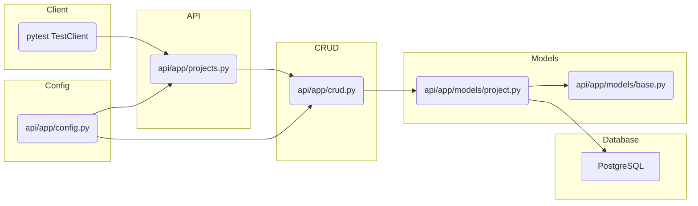

# System Patterns and Architecture

## Overall Architecture

The application is a FastAPI microservice designed to manage projects and their versions. It follows a standard layered architecture:

-   **API Layer:**  `api/app/projects.py` defines the RESTful API endpoints using FastAPI's routing system.  It receives requests, interacts with the CRUD layer, and returns responses.
-   **CRUD Layer:** `api/app/crud.py` contains the database interaction logic (Create, Read, Update, Delete operations). It uses SQLAlchemy to interact with the PostgreSQL database.  *This layer is now implemented using synchronous SQLAlchemy operations.*
-   **Models Layer:** `api/app/models/` defines the database models using SQLAlchemy's declarative base.  These models represent the structure of the database tables.
-   **Schemas Layer:** (Implicit in `projects.py` and potentially in a separate `schemas` directory)  Pydantic models are used for request and response validation and serialization/deserialization.
- **Configuration:** `api/app/config.py` handles application settings, including database connection details, using Pydantic's `BaseSettings`.

## Database Interaction

-   The application uses SQLAlchemy as the ORM to interact with a PostgreSQL database.
-   The application now uses `psycopg2-binary` for synchronous database operations.
-   Connection pooling is configured in `config.py`.
-   Database sessions are managed using FastAPI's dependency injection system (`get_db` dependency).

## Testing Strategy

-   The testing strategy is to use `pytest` with FastAPI's `TestClient` for integration testing of the API endpoints.
-   A separate test database is used to isolate tests from the development/production database.
-   Fixtures in `conftest.py` handle database setup (creating tables) and teardown (dropping tables) for each test module.
-   The tests are now fully synchronous and passing.

## Component Relationships



## Design Patterns

-   **Dependency Injection:** FastAPI's dependency injection system is used to manage database sessions (`get_db`).
-   **Repository Pattern:** The `crud.py` module acts as a repository, abstracting the database interaction logic from the API endpoints.
-   **Data Mapper:** SQLAlchemy's ORM acts as a data mapper, mapping database tables to Python objects.
-   **Active Record (Potentially):** The SQLAlchemy models could be considered a form of Active Record, as they combine data access logic with the data itself.

## Version Number Semantics

The system follows specific rules for managing project versions:

### Version Number Rules
- Each project starts with version 0 automatically (created in ProjectCRUD.create)
- Version numbers must be non-negative (enforced by database CHECK constraint)
- Version numbers must be unique within a project (enforced by database UNIQUE constraint)
- Version numbers can be reused across different projects
- Version numbers do not need to be sequential (e.g., can have versions 0, 1, 5)
- Version numbers are ordered ascending when retrieved

### Version Relationships
- Versions support parent-child relationships through parent_version_id
- A version can have multiple child versions (tree structure)
- The initial version (0) typically serves as the root
- Parent-child relationships are preserved even when projects are soft-deleted

### Version Lifecycle
- Versions are created with the project (version 0) or explicitly (other versions)
- Versions persist when a project is soft-deleted (business decision to preserve history)
- Version numbers cannot be modified after creation (would violate uniqueness)
- The latest_version_number is computed dynamically as the maximum version number

### Implementation Details
- Database constraints:
  ```sql
  UNIQUE(project_id, version_number)
  CHECK(version_number >= 0)
  ```
- Pydantic validation ensures non-negative version numbers at API level
- SQLAlchemy hybrid_property computes latest_version_number
- Versions are ordered by version_number in queries

## Known Issues and TODOs

-   *None* All known issues have been resolved.
