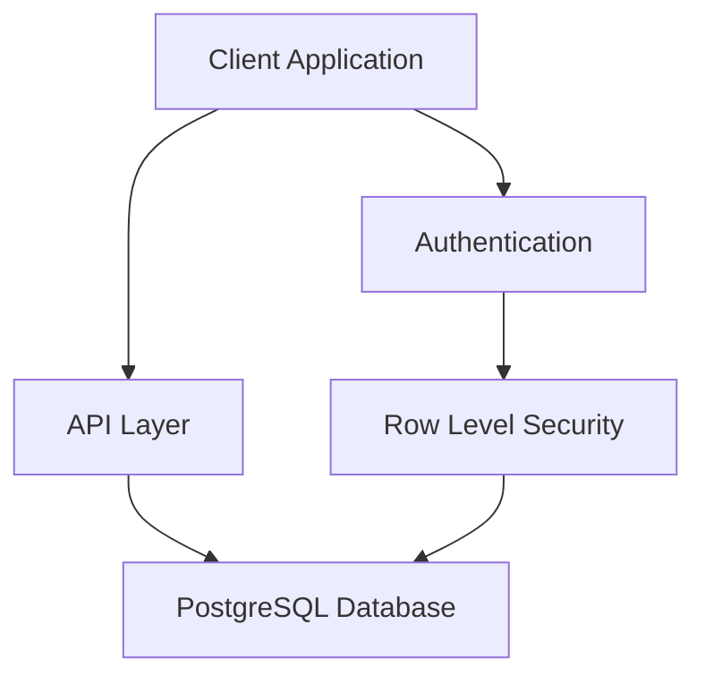

# System Patterns

## Architecture
- Backend: Supabase (PostgreSQL)
- Authentication: Supabase Auth
- API: RESTful + Real-time
- Database: PostgreSQL

## Technical Decisions
1. Database Design
   - Use PostgreSQL native features
   - Implement RLS policies
   - Utilize PostgreSQL functions

2. Authentication
   - Supabase built-in auth
   - JWT token management
   - Role-based access

3. API Design
   - RESTful principles
   - Real-time subscriptions
   - Proper error handling

## Design Patterns
- Repository pattern for data access
- Service layer for business logic
- Event-driven for real-time updates
- Policy-based security

## Component Relationships

## CLI Command Patterns
- Database: `supabase db [action]`
- Auth: `supabase auth [action]`
- API: `supabase api [action]`
- Functions: `supabase functions [action]`
